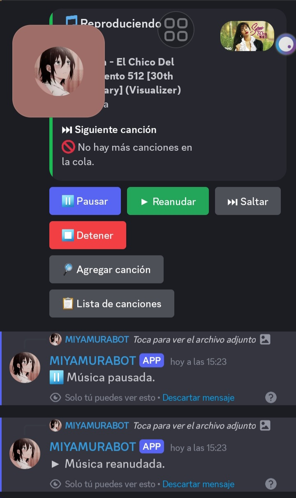

# 🎵 Miyamura Music Bot

Un bot de discord para administración ee servers y reproducir música en canales de voz utilizando discord-player y discord.js.


## 🚀 Características

- 🎶 Reproducir música desde YouTube

- ⏸️ Pausar y reanudar la música

- ⏭️ Saltar canciones

- ⏹️ Detener la reproducción

- 🔊 Ajustar el volumen

- 📜 Ver la lista de reproducción

- ⏳ Mostrar el tiempo restante de la canción actual


## 📦 Instalación

### Requisitos
- Node.js v16 o superior
 
- Un bot de Discord con los permisos necesarios

- Un token de bot de Discord

### pasos 
 1. Clona este repositorio:

```bash
  git clone https://github.com/Fort503/bot-musica-para-discord
cd bot-musica-para-discord
```
2. Instala las dependencias:
```bash
  npm install
```
3. Ir a index.js y añade tu token de bot:
```index.js 
  renglon 78 entre las "" poner tu token 
```


4. Inicia el bot
```bash
  node index.js
```


    
## 🛠 Comandos

#### lista de comandos

| Comando         | Descripción                                      |
| :------------- | :---------------------------------------------- |
| `!play <nombre>` | **Requerido**. Reproduce una canción en el canal de voz. |
| `!stop`         | Detiene la reproducción y borra la cola.       |
| `!skip`         | Salta la canción actual.                       |
| `!pause`        | Pausa la reproducción.                         |
| `!resume`       | Reanuda la reproducción.                       |
| `!volume <0-100>` | **Requerido**. Ajusta el volumen.            |
| `!list`         | Muestra la lista de reproducción.              |
| `!info`         | Muestra información de la canción actual.      |
| `!time`         | Muestra el tiempo restante de la canción.      |


## 📝 Notas
- El bot debe tener permisos para conectarse y hablar en los canales de voz.

- Asegúrate de configurar correctamente las intenciones en el portal de Discord Developer.

## 📸 Capturas de pantalla




## 🤖 MiyamuraBot 

- [@MiyamuraBot](https://discord.com/oauth2/authorize?client_id=1351073834148823070&permissions=8&integration_type=0&scope=bot)

## Server Bots Powered By Cuervo-Team-Supreme 

- [@server]()
## 👨‍💻 Desarrollado por

- [@Christopher Moz](https://github.com/Fort503)

